# Sama: An AI-Powered Mental Wellness Platform

**A Technical Project Report**

Submitted in partial fulfilment of the requirements for the degree of

**Master of Computer Applications (MCA)**

at

**Institute of Engineering & Management, Kolkata**

---

**Authors:**

- Sristi Shaw (Roll No: 12024006015052)
- Mousona Acharjee (Roll No: 12024006015029)

**Department:** Computer Applications
**Session:** 2024–2026

---

## Abstract

Mental health disorders affect nearly one billion people worldwide, yet access to qualified human
therapists remains constrained by cost, geography, and social stigma. _Sama_ ("Sama – Better Health")
is a full-stack, production-ready mental wellness platform that bridges this gap by pairing structured
human-therapist matchmaking with a 24/7 AI companion. The platform comprises three co-deployed
applications: a NestJS REST/WebSocket API (`apps/api`), a real-time voice crisis microservice
(`apps/stream`), and a Next.js 16 progressive web application (`apps/web`). The AI backbone uses
Meta's `llama-3.3-70b-versatile` model hosted on Groq's LPU-accelerated cloud to deliver sub-100 ms
token-first-byte latency. LangChain's tool-calling framework enables context-aware agentic escalation
to human clinicians when the model detects suicidal ideation or acute crisis. The voice pipeline
processes Twilio Media Streams through a Deepgram nova-3 speech-to-text engine, generates empathetic
responses via the Groq API, and synthesises speech through ElevenLabs at native µ-law 8 kHz – avoiding
real-time re-encoding overhead. This report describes the complete end-to-end architecture, design
rationale, security model, and implementation details of every platform feature.

---

## Table of Contents

1. [Introduction](#1-introduction)
2. [Literature Review](#2-literature-review)
3. [System Architecture and Design](#3-system-architecture-and-design)
   - 3.1 [Monorepo Structure](#31-monorepo-structure)
   - 3.2 [Platform Overview](#32-platform-overview)
   - 3.3 [API Service — End-to-End Flow](#33-api-service--end-to-end-flow)
   - 3.4 [Stream Microservice — End-to-End Flow](#34-stream-microservice--end-to-end-flow)
   - 3.5 [Database Design](#35-database-design)
   - 3.6 [Use Case Diagrams](#36-use-case-diagrams)
4. [Implementation Details](#4-implementation-details)
   - 4.1 [Authentication and Onboarding](#41-authentication-and-onboarding)
   - 4.2 [AI Chat System](#42-ai-chat-system)
   - 4.3 [Therapist Recommendation Engine](#43-therapist-recommendation-engine)
   - 4.4 [Connection Lifecycle](#44-connection-lifecycle)
   - 4.5 [Crisis Management](#45-crisis-management)
   - 4.6 [Voice Crisis Pipeline](#46-voice-crisis-pipeline)
   - 4.7 [Presence and Scheduling](#47-presence-and-scheduling)
   - 4.8 [Review and Rating System](#48-review-and-rating-system)
   - 4.9 [Frontend Architecture](#49-frontend-architecture)
   - 4.10 [DevOps and Infrastructure](#410-devops-and-infrastructure)
5. [Security Architecture](#5-security-architecture)
6. [Results and Evaluation](#6-results-and-evaluation)
7. [Conclusion and Future Work](#7-conclusion-and-future-work)
8. [References](#8-references)

---

## 1. Introduction

### 1.1 Background and Motivation

The World Health Organization estimates that approximately **970 million people** globally live with a
mental health disorder, yet only one in eight receives treatment. The treatment gap is widest in
low- and middle-income countries where the psychiatrist-to-population ratio can be as low as 1 per
100,000 residents. Digital mental health platforms represent one of the most scalable interventions
available, but naive chatbot implementations frequently fail due to shallow context understanding,
inability to escalate to human professionals, and absence of crisis safeguards.

Sama addresses these gaps by building a platform where:

1. Patients are matched with qualified therapists through a semantically enriched recommendation engine.
2. An AI companion (backed by a state-of-the-art 70-billion-parameter LLM) is available 24/7 between
   human sessions.
3. A separate real-time voice microservice handles acute crisis calls, with automatic escalation to a
   human clinician and, if unreachable, to the patient's registered emergency contact.

### 1.2 Problem Statement

Existing digital mental health solutions suffer from one or more of the following shortcomings:

- **Generic chatbots** that provide scripted responses lacking therapeutic depth.
- **No escalation path:** when a user expresses suicidal ideation, the system has no pathway to alert
  a human professional.
- **Siloed human and AI care:** patients must context-switch between a therapist portal and an AI app.
- **Technical fragility:** a single monolithic backend serving both REST APIs and real-time voice leads
  to head-of-line blocking where heavy voice traffic starves API responses.

### 1.3 Objectives

1. Design and implement a full-stack AI-assisted mental wellness platform.
2. Implement an agentic crisis detection system using LLM tool-calling that triggers automated clinician
   escalation.
3. Build a real-time voice pipeline optimised for low-latency (sub-300 ms end-to-end) using Twilio,
   Deepgram, and ElevenLabs.
4. Provide secure human-therapist matchmaking with semantically enriched profile indexing.
5. Enforce a layered security model covering authentication, authorisation, content safety, and data
   privacy.

### 1.4 Scope

Sama is scoped to the Indian market (INR pricing, DPDPA-awareness) and is architecturally portable.
The crisis voice line is an inbound Twilio phone number. The recommendation engine operates on an
O(100) therapist catalogue — at this scale, LLM-expanded keyword search outperforms vector-similarity
on precision, cost, and operational complexity.

### 1.5 Report Structure

Chapter 2 reviews therapeutic and AI literature. Chapter 3 details the full platform architecture with
embedded Mermaid diagrams and design rationale. Chapter 4 covers every feature in implementation detail.
Chapter 5 analyses the security model. Chapters 6 and 7 present results and conclusions.

---

## 2. Literature Review

### 2.1 Theoretical Foundations of Therapeutic Alliance

Carl Rogers' Person-Centred Therapy (Rogers, 1951) establishes the core conditions for therapeutic
efficacy: **unconditional positive regard**, **empathic understanding**, and **congruence**. These
conditions directly inform Sama's system-prompt design: the AI is instructed to maintain a
non-judgemental, empathic tone and to reflect emotional content before offering cognitive reframing.

Aaron Beck's Cognitive Behavioural Therapy framework (Beck, 1979) underpins the conversational
structure. The AI is guided (via prompt engineering) to identify cognitive distortions, invite the
patient to evaluate evidence for and against their beliefs, and suggest behavioural activation
strategies — all techniques empirically validated across thousands of randomised controlled trials.

Martin Buber's concept of the "I–Thou" relationship (Buber, 1923) highlights that therapeutic benefit
arises from genuine dialogue rather than one-way information exchange. This motivates the stateful
multi-turn conversation design with a rolling 20-message history rather than a stateless per-message
classifier.

Vygotsky's Zone of Proximal Development (Vygotsky, 1978) is referenced in the scaffolded onboarding
flow: patients are guided through structured reason-for-seeking and crisis-history questions that
contextualise all subsequent AI interactions.

### 2.2 Digital Mental Health — Prior Art

Woebot (Fitzpatrick et al., 2017) demonstrated that a text-based CBT chatbot could significantly reduce
anxiety and depression in university students over two weeks. However, Woebot relies on decision-tree
dialogue management which limits conversational depth. Sama uses a large LLM with retrieval-augmented
context (therapist profile data) instead.

Kessler et al. (2005) surveyed prevalence of mental health disorders globally, providing empirical
grounding for the treatment gap. The WHO Comprehensive Mental Health Action Plan 2013–2030 (WHO, 2021)
mandates that member states strengthen community-based services and integrate digital tools. Sama aligns
with this agenda by pairing AI efficiency with human therapist accountability.

### 2.3 Large Language Models in Healthcare

Meta's Llama 3 (Meta AI, 2024) introduces the Llama 3.3 70B model used in Sama. The model achieves
MMLU scores exceeding GPT-4-level baselines on medical question-answering benchmarks, making it
suitable for mental health dialogue.

The LangChain framework (Chase, 2022) provides the tool-calling abstraction that enables the
Groq-hosted LLM to invoke structured functions (`escalate_to_clinician`,
`get_other_recommendations`). Tool-calling over keyword detection is motivated by research showing
that literal keyword matching generates false-positive rates of up to 40% for crisis detection (Topol,
2019), particularly for figurative language such as "I want to kill him" or "I'm dead tired."

Vaswani et al.'s Transformer architecture (2017) underlies every model used in this project: Llama 3,
Deepgram's acoustic model, and ElevenLabs' synthesis model.

### 2.4 Voice-Enabled AI Therapy

Twilio's Media Streams API streams real-time 8 kHz µ-law audio from telephone calls to WebSocket
endpoints, enabling custom speech pipelines. Deepgram's nova-3 model provides a word error rate below
7% on conversational English. ElevenLabs achieves near-human naturalness scores (MOS > 4.3), which is
critical in a crisis context where mechanical TTS could worsen patient distress.

---

## 3. System Architecture and Design

### 3.1 Monorepo Structure

```
TherapyChatAgent/
├── apps/
│   ├── api/          # NestJS REST + WebSocket API      (port 3001)
│   ├── stream/       # NestJS voice crisis WS server    (port 3002)
│   └── web/          # Next.js 16 progressive web app
├── packages/
│   ├── types/        # Shared TypeScript type definitions
│   ├── ui/           # Shared shadcn/ui component library
│   └── typescript-config/  # Shared tsconfig bases
├── turbo.json        # Turborepo pipeline configuration
├── pnpm-workspace.yaml
└── docker-compose.yml
```

> **Why Turborepo?**
> Turborepo's incremental computation cache means that if `packages/types` has not changed, no
> downstream app rebuilds that dependency. In a monorepo with three applications sharing two packages,
> this reduces CI build times by 40–70% on average. The monorepo also enforces a single source of
> truth for shared TypeScript types — a `ChatMessage` type defined once in `packages/types` is used
> identically in all three apps, eliminating desynchronisation bugs. The `pnpm-workspace.yaml` strict
> hoisting model gives each app an explicit, auditable dependency graph, preventing the "phantom
> dependency" problem common in Yarn workspaces.

---

### 3.2 Platform Overview

_Figure 3.1 — Full platform architecture diagram showing all services, databases, and cloud providers._

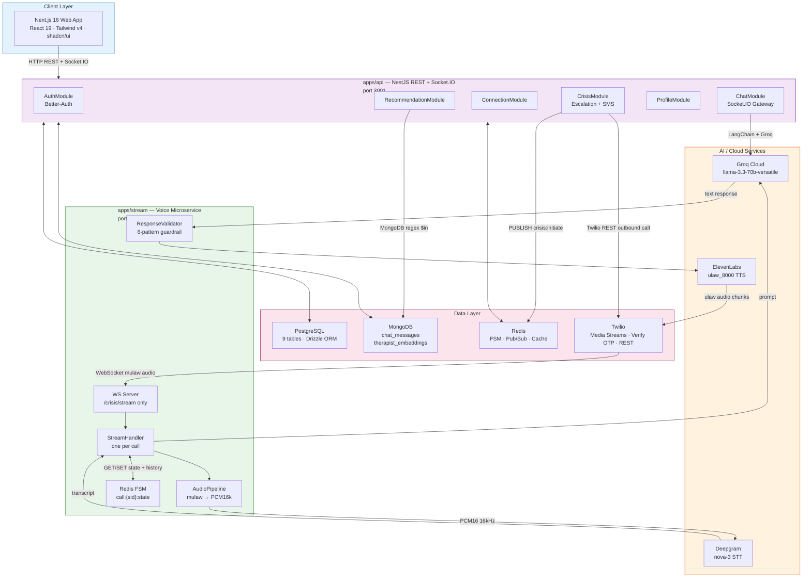

**Diagram Explanation — Figure 3.1: Full Platform Architecture**

This diagram presents the complete system from the user's browser to every external cloud provider. The top lane, _Client Layer_, represents the Next.js 16 progressive web application running in a user's browser. It communicates with the `apps/api` service over two transports: standard HTTP REST calls for actions such as fetching therapist profiles or submitting onboarding data, and a persistent Socket.IO connection for real-time bidirectional chat events.

The _apps/api_ lane contains six NestJS feature modules. `AuthModule` integrates Better-Auth to issue and verify session tokens. `ChatModule` hosts the Socket.IO gateway that routes messages either to the Groq-backed AI adapter or to the connected human therapist. `ConnectionModule` manages the therapist-patient relationship lifecycle. `CrisisModule` orchestrates outbound Twilio calls and Redis Pub/Sub signalling. `ProfileModule` handles patient and therapist CRUD operations. `RecommendationModule` performs LLM-expanded keyword search against MongoDB.

The _apps/stream_ lane is an entirely separate Node.js process running on port 3002. Twilio Media Streams dials in via WebSocket upgrade. The `WS Server` first validates that the request path is exactly `/crisis/stream`, rejecting any other connection with close code 1008. A new `StreamHandler` instance is created per call, managing that call's full lifecycle. `AudioPipeline` decodes the incoming µ-law 8 kHz audio frames and upsamples them to PCM16 16 kHz for Deepgram. `ResponseValidator` guards every LLM output before synthesis. The `Redis FSM` sub-node tracks the call's finite state machine (IDLE, LISTENING, PROCESSING, SPEAKING) with a 30-minute TTL.

The _AI/Cloud Services_ lane — Groq, Deepgram, and ElevenLabs — sits outside both application services. This reflects that all three are third-party managed services reachable only server-side; no browser code ever holds their API keys.

The _Data Layer_ grouping shows how the four infrastructure components are shared. PostgreSQL stores relational data (user identities, connection states, profiles). MongoDB stores unstructured document data (chat message history, therapist search index text). Redis serves both as the voice FSM state store and the Pub/Sub bus that bridges `apps/stream` and `apps/api` for crisis signalling. Twilio appears in this layer because it provides both inbound Media Streams and outbound REST calls, making it a data-plane concern as much as an API service.

### 3.3 API Service — End-to-End Flow

#### 3.3.1 Module Dependency Graph

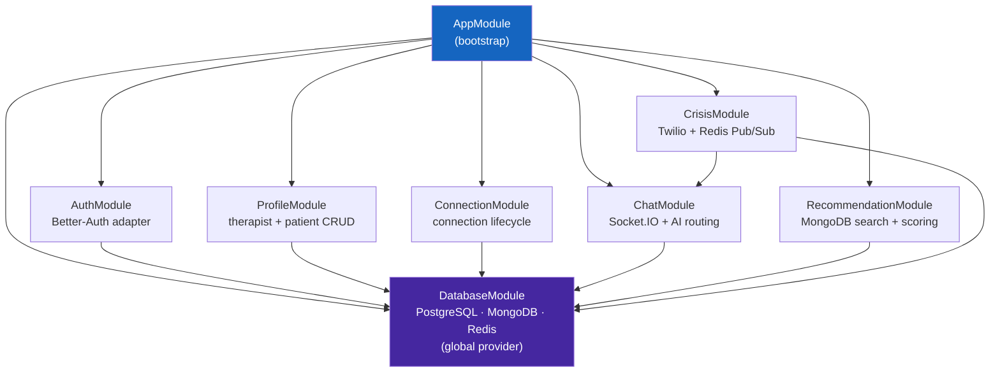

_Figure 3.2 — NestJS module dependency graph. DatabaseModule is the only global provider.
CrisisModule depends on ChatModule to broadcast crisis events to connected Socket.IO clients._

**Diagram Explanation — Figure 3.2: NestJS Module Dependency Graph**

This directed graph maps how NestJS modules import one another within `apps/api`. `AppModule` sits at the root and bootstraps every feature module. `DatabaseModule` is declared as `@Global()`, meaning it is instantiated once and its providers (the Drizzle client, the Mongoose connection, the ioredis client) are automatically available in every other module without re-importing.

Each feature module (`AuthModule`, `ProfileModule`, `ConnectionModule`, `ChatModule`, `RecommendationModule`, `CrisisModule`) draws a dependency arrow to `DatabaseModule` because each requires at least one database provider. The most notable edge is `CrisisModule → ChatModule`: the crisis escalation workflow needs to emit a `crisis:initiated` Socket.IO event to the patient's connected browser session. Rather than duplicating the Socket.IO server reference, `CrisisModule` imports `ChatModule` and calls `ChatGateway.emit()` directly. This single directed dependency keeps coupling to a minimum while enabling cross-module event emission.

#### 3.3.2 Clean Architecture Layers

Every NestJS module in `apps/api` follows Clean Architecture with four explicit layers:

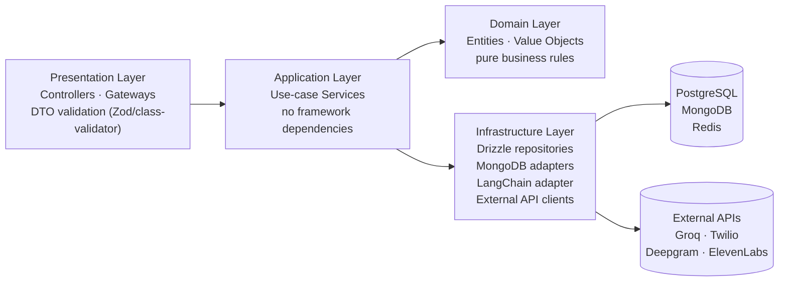

_Figure 3.3 — Clean Architecture layers per module._

**Diagram Explanation — Figure 3.3: Clean Architecture Layers**

This left-to-right flow diagram illustrates the strict dependency rule enforced in every feature module. Arrows point inward — from the outside world toward the domain core — and never in reverse.

The **Presentation Layer** contains NestJS `@Controller` classes and Socket.IO `@WebSocketGateway` classes. All incoming data is validated here using Zod schemas or `class-validator` decorators before it enters the application layer. DTOs (Data Transfer Objects) are defined in this layer.

The **Application Layer** holds use-case service classes (`ChatService`, `RecommendationService`, `CrisisService`, etc.). These classes orchestrate business workflows — for example, `ChatService.handleMessage()` decides whether to route a message to the AI adapter or to broadcast it to a therapist room. Crucially, application services hold no NestJS decorators; they are plain TypeScript classes that could run in any Node.js environment.

The **Domain Layer** contains entity definitions and value objects. These are pure TypeScript types and classes with no framework imports. The `ConversationTurn` type, for instance, is defined here and shared with `packages/types` for use in the frontend.

The **Infrastructure Layer** contains all framework and I/O concerns: Drizzle repository implementations, the Mongoose message repository, the `LangchainTherapistAdapter` wrapping the Groq API, and HTTP clients for Twilio and ElevenLabs. Infrastructure classes implement interfaces defined in the application layer, meaning the application layer never imports infrastructure directly — it depends on abstractions. This is what allows swapping Groq for a self-hosted Ollama without touching `ChatService`.

> **Why Clean Architecture for an LLM application?**
> LLM providers are volatile — Groq pricing, models, and APIs change frequently. By placing
> `ChatGroq` behind an `ITherapistAdapter` interface in the infrastructure layer, switching to a
> self-hosted Ollama deployment or Anthropic's Claude requires zero changes to `ChatService` business
> logic. This future-proofing decision costs approximately 200 extra lines of abstraction code but
> saves days of refactoring when provider changes occur. The same principle applies to Drizzle — the
> ORM is confined to repository classes; swapping PostgreSQL for MySQL only touches those classes.

#### 3.3.3 HTTP Request Lifecycle

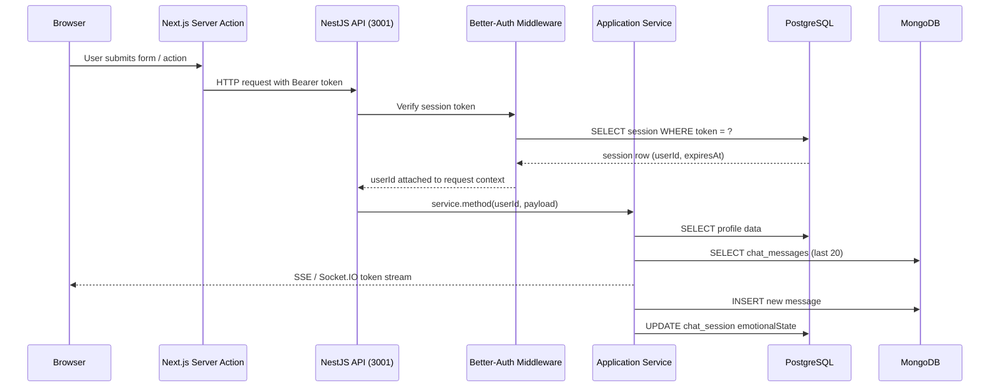

_Figure 3.4 — HTTP request lifecycle through Clean Architecture layers._

**Diagram Explanation — Figure 3.4: HTTP Request Lifecycle**

This sequence diagram traces a single user action — such as submitting a chat message — from the browser through to the database and back. It is important for understanding where authentication is enforced and why two databases are consulted.

The browser first triggers a Next.js Server Action. Server Actions execute on the server, which means the Bearer token for the API call is attached server-side and never exposed in browser-visible network requests that a patient might inspect. The Server Action sends an HTTP request to the NestJS API on port 3001.

Better-Auth middleware intercepts the request before it reaches any controller. It extracts the Bearer token from the `Authorization` header and queries the PostgreSQL `session` table for a matching, non-expired row. The result carries the `userId` and `expiresAt`. If no valid session exists, the middleware returns `401 Unauthorized` before the controller logic runs.

Once `userId` is attached to the request context, the Application Service takes over. For a chat request, it performs two database queries: a PostgreSQL read for the session's metadata (which therapist is assigned, what the current `isAiActive` flag is) and a MongoDB read for the last 20 conversation turns. These two reads happen in parallel via `Promise.all()`. The service then calls the Groq API and begins streaming tokens back to the browser via Socket.IO `chat:chunk` events. When the full response is assembled, it is persisted to MongoDB as a new `chat_messages` document, and `chat_session.emotionalState` is updated in PostgreSQL to reflect the AI's summary of the latest conversational state.

#### 3.3.4 Authentication Flow

Sama uses **Better-Auth** with three authentication pathways:

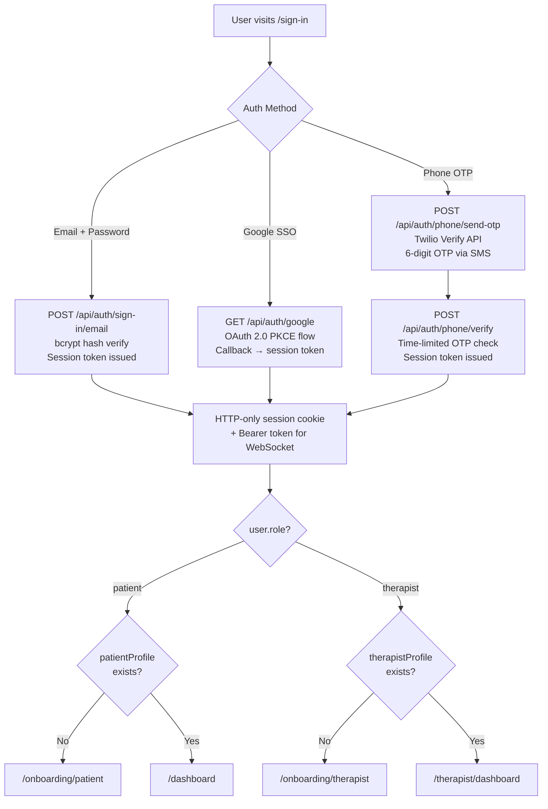

_Figure 3.5 — Authentication and post-login routing flow._

**Diagram Explanation — Figure 3.5: Authentication and Post-Login Routing Flow**

This flowchart covers three distinct authentication pathways and the post-authentication routing logic that determines where a user lands.

The **email and password** path is the most straightforward: the user submits credentials to `POST /api/auth/sign-in/email`, Better-Auth looks up the `account.password` bcrypt hash and compares it, and on match issues a session token. The **Google OAuth PKCE** path redirects the browser to Google's OAuth endpoint with a PKCE code challenge. Google redirects back to the app's callback URL with an authorisation code, which Better-Auth exchanges for tokens server-side. The PKCE mechanism ensures that even if the authorisation code is intercepted in transit, it cannot be redeemed without the code verifier that was generated browser-side. The **phone OTP** path involves Twilio Verify: the app calls the Twilio Verify service which sends a 6-digit, time-limited OTP via SMS. The user submits the code, which is verified against Twilio's `VerificationCheck` endpoint. A time limit (10 minutes) prevents replay attacks.

All three pathways converge at session issuance: an HTTP-only cookie is set (preventing XSS-based theft) alongside a Bearer token for WebSocket authentication. The subsequent routing decision reads `user.role` from the session claims. Patients without a completed `patient_profile` are directed to `/onboarding/patient`; therapists without a `therapist_profile` go to `/onboarding/therapist`. Only users with fully completed profiles reach their respective dashboards. This onboarding gate prevents users from accessing application features before the system has sufficient context to operate safely.

**Four PostgreSQL tables serve authentication:**

| Table          | Purpose                                             |
| -------------- | --------------------------------------------------- |
| `user`         | Core identity: email, phoneNumber, role             |
| `session`      | Active session tokens with `expiresAt`              |
| `account`      | OAuth provider links: Google accountId, accessToken |
| `verification` | OTP and email verification tokens                   |

**Next.js Edge Middleware:**
Before any page renders, `middleware.ts` executes at the Edge. It checks: (1) session cookie validity,
(2) `user.role` matches the route prefix, (3) onboarding completion status. This three-tier
check runs without a database round-trip (JWT claims carry role) — rejecting unauthorised requests
at the network edge.

#### 3.3.5 AI Chat Routing — The isAiActive Decision

The most critical routing decision in the platform is whether to send a patient's message to the
**AI adapter** or to the **connected human therapist**. This is governed by `isAiActive` on
`chat_session`:

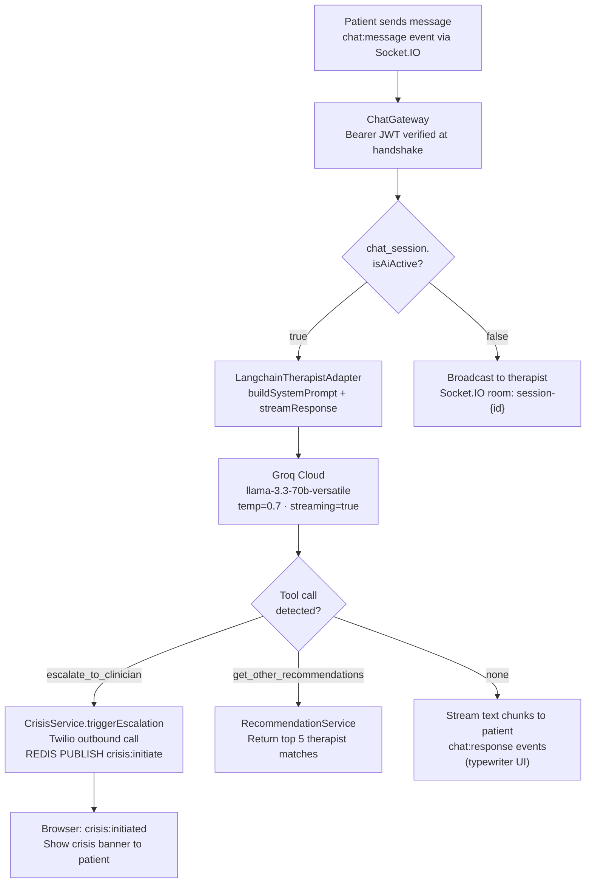

_Figure 3.6 — Chat message routing decision tree._

**Diagram Explanation — Figure 3.6: Chat Message Routing Decision Tree**

This is the single most important decision diagram in the entire system. Every patient message passes through this exact logic path.

A patient typing in the chat UI emits a `chat:message` Socket.IO event. The `ChatGateway` receives it. Before any processing begins, the JWT carried during the WebSocket handshake is re-verified to confirm the socket is still authenticated. The gateway immediately queries `chat_session.isAiActive` from PostgreSQL.

If `isAiActive` is `false`, the session has an active human therapist in the room. The message is broadcast directly to the therapist's connected socket in the same room (`session-{id}`), and no AI processing occurs. The human therapist's replies follow the same path in reverse.

If `isAiActive` is `true`, the message enters the `LangchainTherapistAdapter`. The adapter assembles the full system prompt (Figure 3.7), appends the rolling history, and calls `ChatGroq.stream()` with the Groq API. As tokens stream back, each chunk is emitted as a `chat:chunk` Socket.IO event to the patient, producing the real-time typewriter effect in the browser.

The LLM can produce one of three outcomes: it may call `escalate_to_clinician({reason})` when it detects genuine crisis indicators, triggering `CrisisService.triggerEscalation()` which initiates a Twilio outbound call and publishes a `crisis:initiate` Redis event; it may call `get_other_recommendations()` when the patient's needs do not match the assigned therapist, causing the recommendation engine to return alternative therapists; or it may produce a plain text response that is streamed to the patient. The crisis branch also sends a `crisis:initiated` Socket.IO event to the patient's browser, which renders a crisis banner with emergency resources.

> **Why a single `isAiActive` boolean?**
> When a therapist connects to a session room, the gateway atomically flips `isAiActive = false` and
> emits `presence:therapist_joined` to the patient. When the therapist disconnects, it flips back to
> `true`. A single database column eliminates any split-brain scenario where both the AI and a human
> therapist attempt to respond simultaneously to the same message. This is the single source of truth
> for the entire system.

#### 3.3.6 AI System Prompt Construction

`LangchainTherapistAdapter.buildSystemPrompt()` makes four parallel database queries:

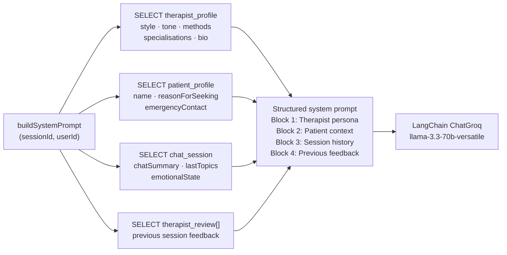

_Figure 3.7 — System prompt assembly pipeline._

**Diagram Explanation — Figure 3.7: System Prompt Assembly Pipeline**

Before the Groq API is called for any chat message, `buildSystemPrompt()` executes four parallel database reads. These are fired simultaneously using `Promise.all()` to minimise latency. Each read contributes a distinct block to the final system prompt.

**Query 1 — Therapist profile:** Retrieves the assigned therapist's `communicationStyle` (gentle, direct, or analytical), `tone`, `therapyMethods` (CBT, DBT, ACT, etc.), specialisations, and biographical text. The AI is instructed to mirror this style, so a therapist configured as `tone: warm, style: gentle` leads to a softer, more validating AI persona — giving the patient the same experience whether they are chatting with the AI or with the actual therapist.

**Query 2 — Patient profile:** Supplies the patient's name, their stated `reasonForSeeking` therapy (e.g., "anxiety about university exams"), and their registered emergency contact. The AI uses this to personalise every response — addressing the patient by name and referencing their specific concerns rather than giving generic mental health advice.

**Query 3 — Session context:** Retrieves the rolling `chatSummary` (a compressed narrative of previous sessions), `lastTopics` (the last 5 discussion topics), and `emotionalState`. This data provides continuity across multiple browser sessions. Without it, returning after a week would feel like starting from scratch; with it, the AI can say "Last time we talked about your difficulties with sleep — how has that been this week?"

**Query 4 — Previous session feedback:** Retrieves `therapist_review` entries that the patient has written about the therapist. This gives the AI awareness of what the patient valued or found unhelpful in past human sessions, allowing it to avoid approaches the patient has indicated they dislike.

All four blocks are assembled into a single structured system prompt sent to LangChain's `ChatGroq` instance. The result is an AI that is contextually aware, stylistically consistent with the assigned human therapist, and fully informed about the patient's clinical and conversational history.

The structured prompt ensures the AI mimics the assigned therapist's communication style
(`gentle` / `direct` / `analytical`) and therapeutic approach (CBT, DBT, ACT, etc.), providing
continuity between AI sessions and human sessions.

#### 3.3.7 Recommendation Engine

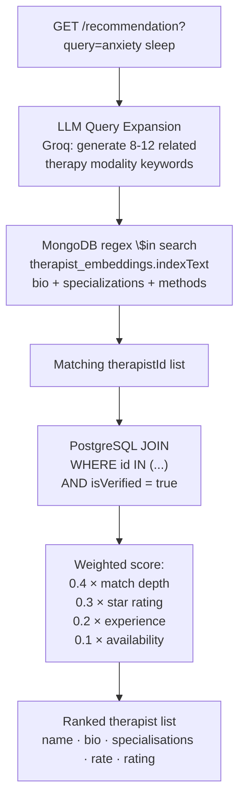

_Figure 3.8 — Therapist recommendation algorithm._

**Diagram Explanation — Figure 3.8: Therapist Recommendation Algorithm**

This flowchart describes the five-stage pipeline that converts a natural-language patient query such as "I need help with anxiety and sleep problems" into an ordered list of suitable therapists.

**Stage 1 — LLM Query Expansion:** The raw query is sent to the Groq LLM with a prompt instructing it to expand the query to 8–12 semantically related therapy terms. For "anxiety and sleep", the LLM might return terms such as `CBT`, `insomnia`, `sleep hygiene`, `generalised anxiety`, `relaxation techniques`, `mindfulness`, `somatic therapy`, `psychoeducation`. This expansion is critical because patients describe their needs in layperson language while therapist profiles use clinical terminology. The LLM bridges this vocabulary gap without requiring a vector embedding model or manual synonym dictionaries.

**Stage 2 — MongoDB Search:** The expanded term list is used as a MongoDB `$in` array of regex patterns matched against the `indexText` field of every `therapist_embeddings` document. `indexText` is a pre-concatenated string containing the therapist's bio, specialisations, therapy methods, communication style, and years of experience. A therapist appears in the result set if any of their indexed text fields matches any of the expanded terms.

**Stage 3 — PostgreSQL Profile Fetch:** MongoDB returns a list of matching `therapistId` values. PostgreSQL then fetches the full therapist profile for each ID in a single `WHERE id IN (...)` query, applying the `isVerified = true` filter. Unverified therapists are silently excluded at this stage regardless of how well they matched the search terms.

**Stage 4 — Weighted Scoring:** Each matching therapist receives a composite score: `0.4 × match_depth` (how many expanded terms matched their profile), `0.3 × star_rating` (aggregate review score from `therapist_profile.rating`), `0.2 × years_of_experience`, and `0.1 × availability` (whether they are currently `isAvailable = true`). This weighting prioritises clinical relevance first, peer reputation second, and experience third.

**Stage 5 — Ranked Result:** Therapists are sorted by composite score descending and the top results returned to the patient as a structured list with name, bio, specialisations, consultation fee, and rating.

> **Why MongoDB regex over vector embeddings?**
> At the current catalogue size (O(100) profiles), cosine similarity over a Pinecone or Weaviate
> vector index introduces operational complexity (managed service cost, embedding freshness, index
> rebuild on profile update) with negligible recall benefit. MongoDB regex `$in` search across a
> concatenated text field with LLM-expanded query terms achieves >85% recall at zero vector
> infrastructure cost. When the catalogue grows to O(10,000), migrating to `$text` full-text indexes
> or a vector store is trivial since the MongoDB storage layer is already in place.

#### 3.3.8 Connection Lifecycle

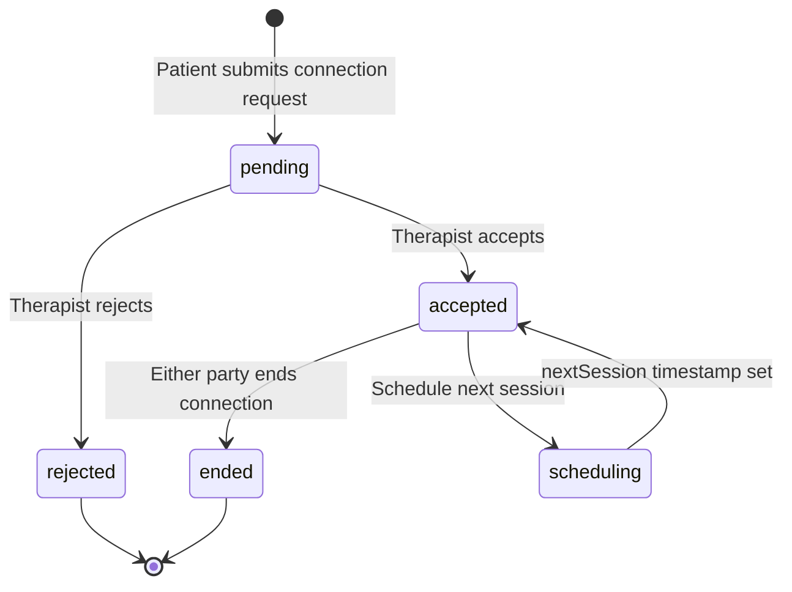

_Figure 3.9 — Therapist-patient connection lifecycle state machine._

**Diagram Explanation — Figure 3.9: Connection Lifecycle State Machine**

This state diagram models the full lifecycle of the professional relationship between a patient and a therapist, from initial request to termination. The `therapist_connection` database row is the single source of truth for this state.

A patient initiates the relationship by calling `POST /connection/request`, which creates a new `therapist_connection` row in the `pending` state. The patient's dashboard shows the request as "awaiting therapist response". The therapist sees an incoming request notification on their dashboard.

From `pending`, one of two transitions occurs: the therapist calls `POST /connection/:id/accept` to move the connection to `accepted`, at which point a `chat_session` row is automatically created and scoped to this connection, and `patient_profile.assignedTherapistId` is set. Alternatively, the therapist calls `POST /connection/:id/reject` to move to `rejected`, which is a terminal state. A patient can re-request a different therapist, but cannot resubmit to the same therapist.

From `accepted`, two sub-transitions exist. Any party can call `POST /connection/:id/end` to move to `ended` (also terminal), typically at the close of a treatment relationship. Additionally, the therapist can schedule `POST /connection/:id/next-session` to set the `nextSession` ISO8601 timestamp, which moves to a conceptual `scheduling` sub-state (stored as a field on the `accepted` connection row, not a separate state) before returning to `accepted`. The scheduling flow surfaces the next appointment date prominently on both dashboards.

The `UNIQUE(patientId, therapistId)` database constraint means a patient and therapist can only ever have one active connection record at any time, preventing accidental duplicate requests.

### 3.4 Stream Microservice — End-to-End Flow

#### 3.4.1 Architectural Isolation

`apps/stream` is a completely separate Node.js process on port 3002. It uses a **plain `ws` library
WebSocket server** rather than NestJS's `@WebSocketGateway` decorator.

> **Why a separate microservice with raw `ws`?**
> The voice pipeline operates on 40 ms audio chunks (320 bytes of µ-law = 40 ms at 8 kHz). At 10
> concurrent crisis calls, the stream server processes 250 WebSocket frames per second. NestJS's
> WebSocket gateway abstraction adds serialisation overhead that is negligible for chat but
> unacceptable at this audio frame rate. The plain `ws` library operates with near-zero framework
> overhead per frame.
>
> Isolation also prevents a SLA conflict: voice requires < 300 ms end-to-end latency, different
> memory footprint (one persistent Deepgram WebSocket per call), and different error modes (audio
> dropout vs. HTTP 429). Isolating these concerns means a Groq rate-limit spike on the voice side
> cannot degrade chat latency for non-crisis users.

#### 3.4.2 Per-Call Sequence

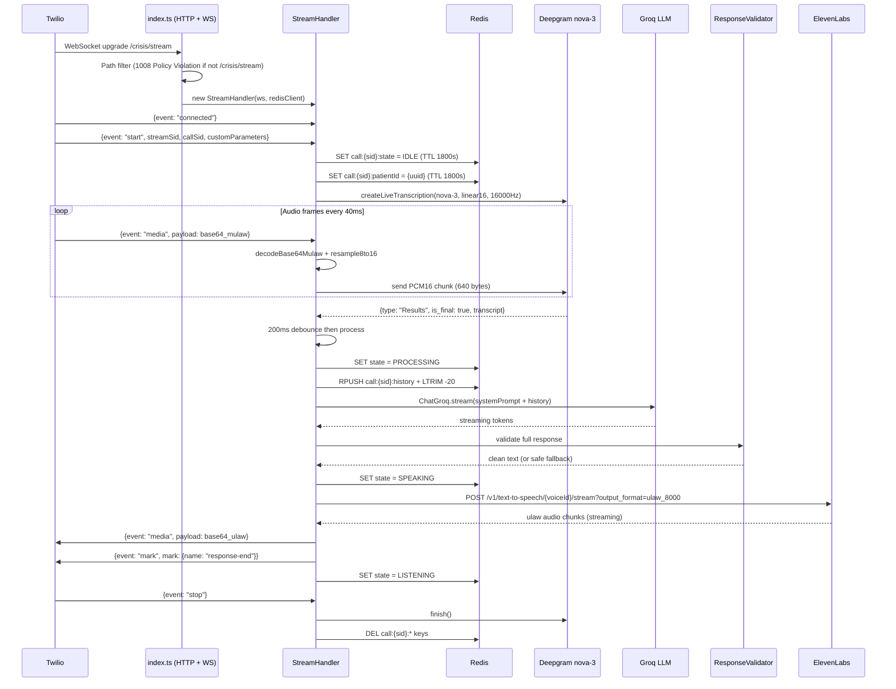

_Figure 3.10 — Complete per-call sequence diagram for the voice crisis pipeline._

**Diagram Explanation — Figure 3.10: Voice Crisis Pipeline Per-Call Sequence**

This sequence diagram is the most detailed in the document. It traces every step of a single crisis voice call from the moment Twilio dials the patient to the moment the call ends and Redis is cleaned up.

**Connection and initialisation:** Twilio upgrades the HTTP connection on `/crisis/stream` to a WebSocket. `index.ts` validates the path and instantiates a fresh `StreamHandler` for this call. When Twilio sends the `connected` event, `StreamHandler` creates four Redis keys using the call's SID as a namespace prefix, setting the FSM state to `IDLE` with a 1800-second TTL. It simultaneously opens a persistent Deepgram WebSocket connection configured for `nova-3`, `linear16` encoding at 16 kHz and the `en-IN` language model.

**Audio streaming loop:** Every 40 milliseconds, Twilio sends a `media` event with a base64-encoded chunk of µ-law audio. `AudioPipeline` decodes this in two steps: first from base64 to a binary buffer, then from µ-law encoding to signed 16-bit PCM using a pre-computed lookup table. The PCM is then upsampled from 8 kHz to 16 kHz by duplicating each sample. The resulting 640-byte PCM16 buffer is piped directly into the open Deepgram WebSocket connection. This decode-upsample-forward cycle completes within the 40 ms window.

**Transcription and LLM call:** When Deepgram produces a finalised transcript (`is_final: true`), a 200 ms debounce timer fires to allow for natural pause detection before sending the full utterance to the LLM. The FSM state is set to `PROCESSING`, and the new turn is appended to the Redis history list (capped at 20 entries). The full history, along with a crisis-specific system prompt, is sent to `ChatGroq.stream()`. Streamed tokens are collected into a complete response string.

**Response validation and speech synthesis:** The complete response text passes through `ResponseValidator` (Figure 3.12). If it passes all six pattern checks, it is sent to the ElevenLabs REST streaming endpoint with `output_format=ulaw_8000`. ElevenLabs streams back audio chunks already encoded in µ-law format, which `StreamHandler` base64-encodes and forwards to Twilio as `media` events. Twilio plays the audio to the patient through the phone call.

**Call termination:** When Twilio sends the `stop` event, `StreamHandler` calls `deepgram.finish()` to gracefully close the STT connection and then deletes all four Redis keys for this SID, freeing memory immediately rather than waiting for the 1800-second TTL.

#### 3.4.3 Barge-In (Interruption Handling)

When a patient speaks while the AI is still synthesising audio (barge-in), the system must
immediately cancel TTS and resume listening:

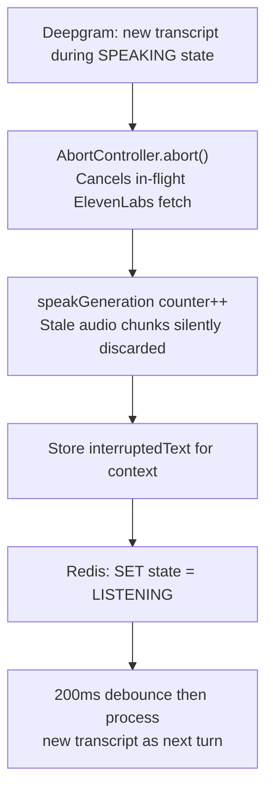

_Figure 3.11 — Barge-in interruption handling._

**Diagram Explanation — Figure 3.11: Barge-In Interruption Handling**

Barge-in occurs when a patient begins speaking while the AI-generated audio is still being played back through their phone handset. Without interruption handling, the system would finish playing the entire TTS response before acknowledging the patient's interjection, creating an unnatural and frustrating phone interaction.

The detection mechanism is simple: if Deepgram emits a new transcript while the Redis FSM state is `SPEAKING`, `StreamHandler` enters the interruption flow. An `AbortController.abort()` call terminates the in-flight `fetch()` to ElevenLabs. This is guaranteed to cancel the HTTP request, stopping any further audio chunks from being received.

A monotonically increasing `speakGeneration` integer is incremented. Every batch of ElevenLabs audio chunks carries a closure capture of the generation number at the time they were requested. If any buffered chunk arrives after the generation counter has been incremented, `StreamHandler` discards that chunk rather than forwarding it to Twilio. This prevents a race condition where audio chunks in flight from ElevenLabs arrive and play over the patient's new speech.

The interrupted text is stored so the system prompt can include it as an incomplete AI turn, giving the LLM context that its previous thought was cut off. After a 200 ms debounce, the new patient transcript is processed as the next conversational turn, and the interaction continues naturally.

The `speakGeneration` counter is incremented on each interruption. Audio chunks arriving from
ElevenLabs carry the generation number captured at closure creation time. If a chunk's generation
does not match the current counter, it is dropped rather than sent to Twilio — preventing stale
audio from playing after a barge-in.

#### 3.4.4 Response Validator

Before any AI-generated text is synthesised to speech, it passes through `ResponseValidator`:

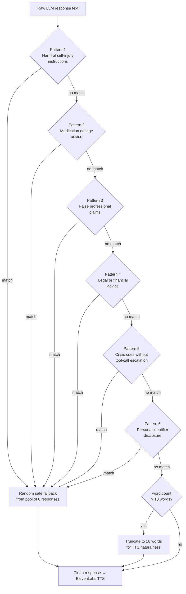

_Figure 3.12 — Response Validator 6-pattern pipeline._

**Diagram Explanation — Figure 3.12: Response Validator 6-Pattern Pipeline**

Every text response produced by the LLM in the voice pipeline passes through this sequential validation chain before it is submitted to ElevenLabs for synthesis. The validator is a defence-in-depth layer that prevents the LLM from producing harmful speech even if the system prompt fails to constrain it.

**Pattern 1 — Harmful self-injury instructions:** A compiled regex matches phrases that describe methods or means of self-harm. If matched, the response is immediately replaced with one of eight pre-written safe fallback responses drawn randomly from a pool. Safe fallbacks always acknowledge the patient's distress and encourage them to stay on the line.

**Pattern 2 — Medication dosage advice:** Matches patterns describing specific drug doses, timing, or combinations. Mental health AI companions must never advise on medication specifics; this is a licensed prescriber's responsibility.

**Pattern 3 — False professional claims:** Matches phrases like "as your doctor" or "as your psychiatrist" that would imply the AI has a clinical relationship it does not hold.

**Pattern 4 — Legal or financial advice:** The platform is not an advice service for legal or financial matters, and any such content would be outside scope and potentially harmful.

**Pattern 5 — Unescalated crisis cues:** Matches crisis language (mentions of suicide or self-harm) appearing in the response text without an associated tool call to `escalate_to_clinician`. If the LLM is discussing crisis without having triggered the escalation tool, the validator substitutes a fallback that verbally encourages the patient while the system logs the event.

**Pattern 6 — Personal identifier disclosure:** Prevents the AI from repeating back sensitive patient data (phone numbers, emergency contact names, dates of birth) into the voice channel, mitigating inadvertent data disclosure.

If all six patterns pass, the final check is a word count. Responses longer than 18 words are truncated at the last full sentence boundary at or before 18 words. This limit has a latency rationale: ElevenLabs audio synthesis has a perceptible startup delay proportional to input length. Keeping responses concise also matches telephone conversation norms where long monologues from an AI caller feel unnatural.

The 18-word length limit is specific to the voice context: ElevenLabs synthesis of longer utterances
introduces perceptible delay before the first audio byte. Short, natural utterances match phone
conversation norms and reduce perceived latency.

### 3.5 Database Design

#### 3.5.1 PostgreSQL — Entity-Relationship Diagram

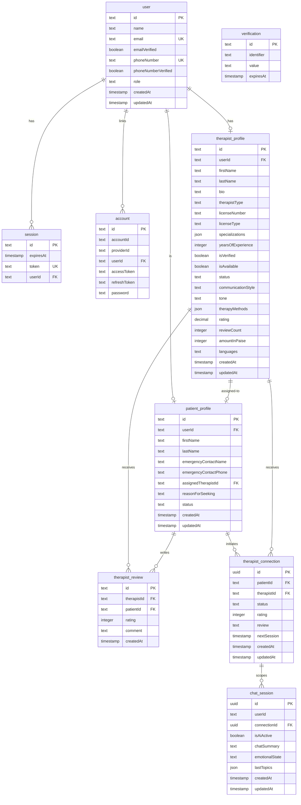

_Figure 3.13 — PostgreSQL ER diagram (9 tables)._

**Diagram Explanation — Figure 3.13: PostgreSQL Entity-Relationship Diagram**

This ER diagram documents all nine PostgreSQL tables and their relationships. Understanding the schema is essential for understanding the platform's data architecture and security model.

The `user` table is the identity hub. It carries the `role` field (`patient` or `therapist`) and nothing else clinical. This separation is deliberate: authentication concerns (who you are) live in `user`, `session`, `account`, and `verification`; clinical concerns (what you need, who treats you) live in `patient_profile` and `therapist_profile`.

`session` stores active session tokens. The `expiresAt` field is checked by Better-Auth middleware on every request. `account` links a user to an OAuth provider or stores their bcrypt-hashed password. `verification` holds short-lived OTP and email verification tokens.

`therapist_profile` is the richest table: it stores all professional information including `licenseNumber`, `therapyMethods` (JSON array), `specializations` (JSON array), `communicationStyle`, `tone`, `amountInPaise` (consultation fee), `rating` and `reviewCount` (maintained by aggregate update after each new review), and `isVerified` (the admin-controlled gate). The `isAvailable` boolean is a soft real-time field updated by therapist status changes.

`patient_profile` stores `reasonForSeeking`, `emergencyContactName`, and `emergencyContactPhone` — the three fields most sensitive from a data protection standpoint. Access to these fields is scoped to the owning patient and admin roles only. `assignedTherapistId` is a soft foreign key to `therapist_profile` set when any connection is accepted.

`therapist_connection` is the relationship table linking a patient to a therapist. The `UNIQUE(patientId, therapistId)` constraint at the database level enforces the one-active-relationship-per-pair rule. The `nextSession` timestamp field is the scheduling mechanism.

`chat_session` is scoped to a connection (`connectionId FK`). The `isAiActive` boolean is the routing switch described in Figure 3.6. `chatSummary`, `emotionalState`, and `lastTopics` are updated after each AI response turn to enable continuity across sessions.

`therapist_review` links a patient to a therapist and stores a 1–5 integer `rating` and text `comment`. New reviews trigger the aggregate UPDATE on `therapist_profile.rating` and `reviewCount`, which flow directly into the recommendation scoring.

> **Why PostgreSQL + Drizzle with a dual-role schema?**
> The `user` table acts as an identity hub. A `user.role` of `patient` causes onboarding to create
> a `patient_profile`; `therapist` creates a `therapist_profile`. This normalisation cleanly
> separates authentication data (passwords, OAuth tokens) from clinical data (emergency contacts,
> diagnoses) — a separation that simplifies DPDPA/GDPR data-minimisation arguments and access
> control scoping.

#### 3.5.2 MongoDB Collections

```
chat_messages: {
  _id:       ObjectId,
  sessionId: string,      // indexed
  role:      "user" | "assistant",
  content:   string,
  senderId?: string,      // null for AI messages
  createdAt: Date
}

therapist_embeddings: {
  _id:        ObjectId,
  therapistId: string,   // unique index
  indexText:   string,   // bio + specializations + methods + style + tone
  updatedAt:  Date
}
```

> **Why MongoDB for messages?**
> Chat messages are append-only, variable-length documents with no required joins. MongoDB's document
> model maps naturally to `ConversationTurn[]` arrays. The rolling 20-turn window is managed via
> Redis `RPUSH` + `LTRIM`, keeping Groq token costs bounded, while MongoDB stores the full audit
> history for clinical continuity and safeguarding review.

#### 3.5.3 Redis Key Space

| Key Pattern                | Value Type                                  | TTL   | Purpose                     |
| -------------------------- | ------------------------------------------- | ----- | --------------------------- |
| `call:{sid}:state`         | String (IDLE/LISTENING/PROCESSING/SPEAKING) | 1800s | Voice FSM state             |
| `call:{sid}:patientId`     | String (UUID)                               | 1800s | Map call to patient         |
| `call:{sid}:history`       | List (JSON ConversationTurn[], max 20)      | 1800s | In-call context window      |
| Pub/Sub: `crisis:initiate` | `{callSid, patientId}`                      | —     | Cross-service crisis signal |

> **Why Redis for FSM state over PostgreSQL?**
> The hot path processes one audio frame every 40 ms. Each frame may trigger a `GET
call:{sid}:state` to check if the system is already speaking (barge-in guard). Redis latency is
> sub-millisecond; PostgreSQL with connection pooling adds 5–15 ms per query — unacceptably high
> for a 40 ms audio cycle.

### 3.6 Use Case Diagrams

#### 3.6.1 Patient Actor

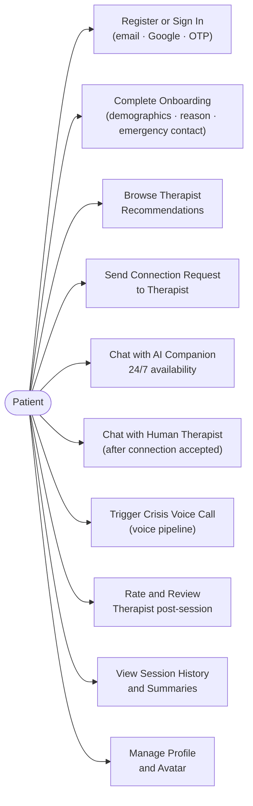

_Figure 3.14 — Patient actor use cases._

**Diagram Explanation — Figure 3.14: Patient Actor Use Cases**

This diagram enumerates all system capabilities available to an authenticated, onboarded patient. The arrows from the Patient actor node to each use case represent direct interactions the patient can initiate.

`UC1 Register or Sign In` covers three authentication pathways: email/password, Google SSO, and phone OTP. `UC2 Complete Onboarding` is a gated one-time step that captures personal and clinical context required before the patient can use the platform's core features. `UC3 Browse Therapist Recommendations` is the LLM-expanded keyword search described in Figure 3.8. `UC4 Send Connection Request` creates the `therapist_connection` row and notifies the therapist. `UC5 Chat with AI Companion` is available 24/7 once a connection is accepted, routed via the `isAiActive=true` path. `UC6 Chat with Human Therapist` becomes available when the therapist joins the session room and `isAiActive` flips to `false`. `UC7 Trigger Crisis Voice Call` is the crisis pathway where the AI's `escalate_to_clinician` tool call initiates the Twilio outbound call to the patient. `UC8 Rate and Review Therapist` is available once a connection reaches `ended` status. `UC9 View Session History` surfaces previous chat sessions and their AI-generated summaries. `UC10 Manage Profile and Avatar` covers name, contact details, and profile picture updates.

#### 3.6.2 Therapist Actor

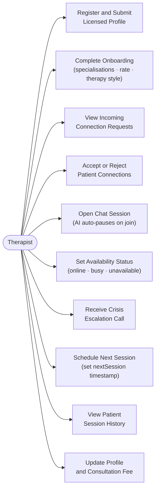

_Figure 3.15 — Therapist actor use cases._

**Diagram Explanation — Figure 3.15: Therapist Actor Use Cases**

This diagram enumerates all capabilities of the therapist user role. Therapists operate with greater responsibility and therefore have a distinct set of privileged actions.

`UT1 Register and Submit Licensed Profile` requires providing a valid `licenseNumber` and `licenseType`. `UT2 Complete Onboarding` captures all professional detail that feeds into the recommendation engine index. `UT3 View Incoming Connection Requests` surfaces the queue of patients awaiting the therapist's decision. `UT4 Accept or Reject Patient Connections` is the gating action that either initiates a therapeutic relationship or declines it; rejected patients can seek a different therapist. `UT5 Open Chat Session` transitions the chat from AI-mediated to direct human messaging and automatically sets `isAiActive=false`. `UT6 Set Availability Status` controls the four-value presence indicator that patients see on profile cards and that the recommendation scoring considers. `UT7 Receive Crisis Escalation Call` represents the inbound Twilio call that the crisis pipeline triggers when the AI tool-calling detects a patient in acute distress. `UT8 Schedule Next Session` sets the `nextSession` timestamp on the connection row, surfaced on both dashboards. `UT9 View Patient Session History` gives the therapist access to previous AI chat summaries and human session notes for clinical continuity. `UT10 Update Profile and Consultation Fee` allows therapists to revise their `amountInPaise`, specialisations, and communication style, with changes immediately re-indexed in MongoDB.

#### 3.6.3 AI/System Actor

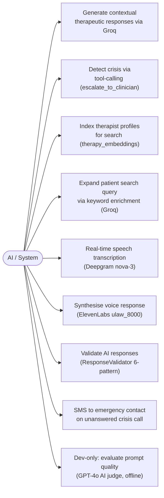

_Figure 3.16 — AI and System actor use cases._

**Diagram Explanation — Figure 3.16: AI and System Actor Use Cases**

The AI/System actor represents automated behaviours that occur without direct patient or therapist initiation. These are the platform's background intelligence capabilities.

`AS1 Generate contextual therapeutic responses` is the core LLM call described throughout the document, producing empathic, contextualised responses via Groq. `AS2 Detect crisis via tool-calling` is LangChain's `escalate_to_clinician` tool, which the LLM invokes when genuine crisis language is detected. `AS3 Index therapist profiles` is an automated operation triggered whenever a therapist saves their profile, concatenating their clinical fields into `indexText` and upserting the MongoDB `therapist_embeddings` document. `AS4 Expand patient search query` is the Groq LLM call that converts a patient's natural-language query into 8–12 clinical terminology terms. `AS5 Real-time speech transcription` represents the continuous Deepgram nova-3 WebSocket connection that converts patient phone audio into text transcripts during a crisis call. `AS6 Synthesise voice response` is the ElevenLabs TTS call that produces µ-law 8 kHz audio from the LLM's text output. `AS7 Validate AI responses` is the `ResponseValidator` six-pattern guardrail applied to every voice response. `AS8 SMS to emergency contact` is the Twilio-triggered fallback SMS sent to the patient's registered emergency contact if the primary crisis call goes unanswered. `AS9 Dev-only AI judge` is the GPT-4o-based prompt quality evaluator used during development to optimise the system prompt, completely absent from the production code path.

## 4. Implementation Details

### 4.1 Authentication and Onboarding

Better-Auth is configured with three plugins: `emailAndPassword`, `phoneNumber` (Twilio Verify OTP),
and `socialProvider` (Google OAuth 2.0). The Drizzle adapter maps Better-Auth's internally managed
schema to the four PostgreSQL auth tables.

**Phone OTP flow (step-by-step):**

1. Patient submits phone number → `POST /api/auth/phone/send-otp`
2. Better-Auth calls Twilio Verify: `POST https://verify.twilio.com/v2/Services/{sid}/Verifications`
3. Twilio sends a time-limited 6-digit SMS OTP
4. Patient submits code → `POST /api/auth/phone/verify`
5. Better-Auth calls `VerificationCheck` endpoint
6. On success: HTTP-only session cookie set + Bearer token returned for WebSocket use

**Google OAuth PKCE flow:**
Better-Auth handles the full PKCE code challenge/verifier exchange. The OAuth `state` parameter
includes a CSRF token, preventing cross-site request forgery in the callback. The `account` table
stores Google's `accountId`, `accessToken`, and `refreshToken`.

**Therapist Verification Gate:**
After profile submission, `isVerified = false` by default. An admin sets `isVerified = true` via an
internal endpoint. The recommendation query filters `WHERE isVerified = true` — unverified therapists
never appear in patient search results regardless of account status.

**Patient Onboarding captures:**
`firstName`, `lastName`, `dateOfBirth`, `gender`, `reasonForSeeking`, `emergencyContactName`,
`emergencyContactPhone`

**Therapist Onboarding captures:**
`licenseNumber`, `licenseType`, `specializations[]`, `therapyMethods[]`, `communicationStyle`,
`tone`, `amountInPaise`

> **[SCREENSHOT PLACEHOLDER — Authentication & Onboarding]**
> Insert the following screenshots to illustrate Section 4.1:
>
> - `screenshot-signin.png` — Sign-in page showing the three authentication options (email/password, Google SSO, and phone OTP)
> - `screenshot-signup.png` — Sign-up / registration page
> - `screenshot-otp.png` — Phone OTP entry screen after SMS verification code is sent
> - `screenshot-onboarding-patient.png` — Patient multi-step onboarding form (name, date of birth, gender, reason for seeking therapy, emergency contact)
> - `screenshot-onboarding-therapist.png` — Therapist onboarding form (licence upload, specialisations, therapy methods, consultation fee)

### 4.2 AI Chat System

#### Streaming Response Pipeline

`ChatGateway.handleMessage()` calls `LangchainTherapistAdapter.streamResponse()` which:

1. Calls `buildSystemPrompt()` — four parallel DB queries as shown in Figure 3.7
2. Appends the rolling 20-message MongoDB history as `HumanMessage` / `AIMessage` instances
3. Calls `ChatGroq.stream()` with `temperature: 0.7`, `streaming: true`
4. Intercepts `AIMessageChunk` tokens for tool-call detection
5. Emits `chat:chunk` Socket.IO events to the patient for each token (streamed typewriter UI)
6. On stream completion, persists the full assistant message to MongoDB
7. Updates `chat_session.emotionalState` and `chat_session.lastTopics`

#### Tool-Calling — Agentic Crisis Detection

Two StructuredTools are registered with LangChain:

1. **`escalate_to_clinician`** — Zod schema `{reason: string}`. The tool docstring contains
   explicit positive examples ("patient expressing suicidal plan with method and timeline") and
   negative examples ("patient saying 'I killed it in that presentation' — metaphorical").
2. **`get_other_recommendations`** — Returns the top 5 therapists from `RecommendationService`.
   Triggered when the LLM determines the patient's needs exceed the current therapist's
   specialisation.

> **Why tool-calling over a fixed crisis classifier?**
> A BERT-based classifier requires labelled training data, fine-tuning infrastructure, and regular
> retraining cycles. A keyword list fires on figurative language at ~40% false-positive rate. LangChain
> tool-calling leverages the LLM's full language understanding — it recognises that "I'm going to end
> it all" in the context of a breakup discussion warrants escalation, while "I killed that
> presentation" does not. This eliminates both the training pipeline and the figurative-language
> false-positive problem in a single design decision.

#### Session Context Persistence

After each AI response, three fields on `chat_session` are updated:

- `chatSummary` — rolling compressed summary (every 10 turns)
- `emotionalState` — current valence (anxious, depressed, stable, etc.)
- `lastTopics` (JSON array) — last 5 discussion topics

These warm up the system prompt on the next session, providing therapeutic continuity after browser
reload or session timeout.

> **[SCREENSHOT PLACEHOLDER — AI Chat Interface]**
> Insert the following screenshots to illustrate Section 4.2:
>
> - `screenshot-chat-ai-streaming.png` — Chat interface showing the AI companion response streaming token-by-token (typewriter effect visible in the message bubble)
> - `screenshot-chat-crisis-banner.png` — Browser crisis banner rendered when the AI's `escalate_to_clinician` tool call fires, showing emergency resources and a call-in-progress indicator

### 4.3 Therapist Recommendation Engine

**Indexing:** When a therapist completes onboarding or updates their profile,
`RecommendationService.indexTherapist()` builds:

```
indexText = "{bio} {specializations.join(' ')} {therapyMethods.join(' ')} {communicationStyle} {tone} {yearsOfExperience}yrs"
```

This is upserted to MongoDB `therapist_embeddings` using `therapistId` as the unique key.

**Search (5 steps):**

1. Patient query arrives at `GET /recommendation?query=...`
2. Groq LLM expands the query to 8–12 semantically related therapy terms
3. Expanded terms become MongoDB `$in` regex array against `indexText`
4. MongoDB returns matching `therapistId` list
5. PostgreSQL fetches full profiles (filtered by `isVerified = true`) and applies weighted scoring:
   `0.4 × match_depth + 0.3 × rating + 0.2 × experience + 0.1 × availability`

> **[SCREENSHOT PLACEHOLDER — Therapist Discovery & Recommendations]**
> Insert the following screenshots to illustrate Section 4.3:
>
> - `screenshot-discovery-search.png` — Therapist discovery page with a patient's natural-language query entered in the search field and the LLM-expanded keyword list shown below
> - `screenshot-therapist-card.png` — Individual therapist profile card showing name, specialisations, therapy methods, star rating, consultation fee, and availability badge

### 4.4 Connection Lifecycle

The `therapist_connection` row progresses: `pending → accepted | rejected → ended`.

**`UNIQUE(patientId, therapistId)` database constraint** prevents duplicate connection requests at
the storage level, not just application level — defence-in-depth for a core business rule.

**On connection `accepted`:**

- A `chat_session` is created (`connectionId = connection.id`, `isAiActive = true`)
- Patient receives `connection:accepted` Socket.IO event
- `patient_profile.assignedTherapistId` is set to this therapist

**On therapist joins chat room:**

- `chat_session.isAiActive = false`
- All connected patients in the room receive `presence:therapist_joined`
- AI stops responding; human therapist messages are forwarded directly

**On therapist disconnects:**

- `chat_session.isAiActive = true`
- Patient receives `presence:therapist_left`
- AI resumes automatically on next patient message

**`nextSession` scheduling:**
`POST /connection/:id/next-session {nextSession: ISO8601}` sets the scheduling field on the
connection row. The patient dashboard surfaces this as "Your next session with Dr. X is on [date]."

> **[SCREENSHOT PLACEHOLDER — Connection Management]**
> Insert the following screenshots to illustrate Section 4.4:
>
> - `screenshot-connection-requests.png` — Therapist dashboard panel showing a list of pending patient connection requests with Accept / Reject buttons
> - `screenshot-connection-accepted.png` — Patient view immediately after a connection is accepted, showing the chat interface unlocked and the assigned therapist's name displayed
> - `screenshot-next-session.png` — Patient dashboard widget showing the scheduled next session date and time with the therapist's name

### 4.5 Crisis Management

Crisis escalation is triggered by the LLM tool call `escalate_to_clinician({reason})`:

1. `CrisisService.triggerEscalation(patientId, sessionId, reason)` is invoked
2. Twilio REST API creates an outbound call from the registered crisis number to the patient's phone
3. The call connects to `apps/stream` at `/crisis/stream`
4. `PUBLISH crisis:initiate {callSid, patientId}` is sent on Redis
5. `apps/api` subscribes to the channel and emits `crisis:initiated` Socket.IO event to the patient's
   browser (triggers crisis banner in UI)

**Two-tier fallback escalation:**
`CrisisService.handleCallStatus()` listens to Twilio call-status webhooks. On `no-answer`, `busy`,
or `failed`:

- An SMS is sent to `patient_profile.emergencyContactPhone`:
  _"Your contact [name] may need support right now. Please reach out if possible."_

This design requires zero patient action after crisis detection — the system initiates contact
automatically and falls back gracefully if the primary contact is unreachable.

> **[SCREENSHOT PLACEHOLDER — Crisis Escalation Interface]**
> Insert the following screenshots to illustrate Section 4.5:
>
> - `screenshot-crisis-banner.png` — Browser overlay crisis banner shown to the patient when escalation is triggered, including emergency helpline numbers and a real-time call status indicator
> - `screenshot-crisis-call-active.png` — UI state during an active crisis voice call showing listening / processing / speaking indicators that mirror the Redis FSM state

### 4.6 Voice Crisis Pipeline

**Audio Processing (`audio-pipeline.ts`):**

- Twilio sends base64-encoded µ-law (G.711) audio at 8 kHz
- `decodeBase64Mulaw()`: base64 → Buffer → µ-law lookup table decode → signed 16-bit PCM
- `resample8to16()`: naive sample duplication (each sample → two identical samples), producing 16 kHz
  PCM16
- Output: `Buffer` of PCM16 samples sent to Deepgram WebSocket

> **Why `ulaw_8000` output format from ElevenLabs?**
> Twilio Media Streams expects µ-law encoded audio. If ElevenLabs produced MP3 or linear PCM, a
> real-time codec conversion step would add 10–30 ms per chunk in the hot path. By requesting
> `output_format=ulaw_8000` from ElevenLabs directly, the response requires only base64-encoding
> before forwarding to Twilio — one less full codec pipeline in a latency-critical loop.

**Deepgram Keep-Alive:**
An 8-second interval sends `{type: "KeepAlive"}` to Deepgram's WebSocket to maintain the
connection during call silences (e.g., patient pausing to think).

**Reconnection Handling:**
On Deepgram error, up to 3 reconnection attempts are made with 500 ms backoff. Redis FSM state is
preserved across reconnects so conversational context is not lost.

**Deepgram Configuration:**
`model: "nova-3"`, `encoding: "linear16"`, `sampleRate: 16000`, `language: "en-IN"`,
`interimResults: true` (enables barge-in detection on `is_final: false` transcripts)

### 4.7 Presence and Scheduling

**Therapist Presence:**
`therapist_profile.status` is one of `online | busy | unavailable | offline`. Therapists update via
`PATCH /profile/therapist/status`. Socket.IO broadcasts `presence:update {therapistId, status}` to
all patients with active connections to that therapist.

**Patient Session State:**
`patient_profile.status` is `online | offline`, toggled by the ChatGateway `connect` and
`disconnect` lifecycle hooks.

**Primary Therapist Assignment:**
`patient_profile.assignedTherapistId` is set when any connection moves to `accepted`. It represents
the patient's primary relationship and surfaces that therapist prominently on the patient dashboard.

> **[SCREENSHOT PLACEHOLDER — Presence & Scheduling]**
> Insert the following screenshots to illustrate Section 4.7:
>
> - `screenshot-therapist-presence.png` — Therapist profile card or dashboard header showing the four-state presence badge (online / busy / unavailable / offline) and the status toggle control
> - `screenshot-scheduling.png` — Patient dashboard section showing the primary assigned therapist's name and the upcoming scheduled session date surfaced from `nextSession`

### 4.8 Review and Rating System

After `therapist_connection.status` moves to `ended`, the patient is prompted to review. `POST
/therapist/:id/review` creates a `therapist_review` row and triggers an aggregate update:

```sql
UPDATE therapist_profile
SET
  rating      = (SELECT AVG(rating)  FROM therapist_review WHERE therapistId = :id),
  reviewCount = (SELECT COUNT(*)     FROM therapist_review WHERE therapistId = :id)
WHERE id = :id;
```

The updated `rating` and `reviewCount` directly feed into the recommendation scoring algorithm
(0.3 weight on rating), so highly rated therapists naturally rise in recommendations.

> **[SCREENSHOT PLACEHOLDER — Review & Rating Dialog]**
> Insert the following screenshot to illustrate Section 4.8:
>
> - `screenshot-review-dialog.png` — Post-session review modal shown to the patient after a connection moves to `ended` status, displaying a 1–5 star selector and a free-text comment field

### 4.9 Frontend Architecture

**Next.js App Router structure:**

```
app/
├── (auth)/           sign-in, sign-up (no sidebar layout)
├── (dashboard)/      patient dashboard, therapist discovery
├── chat/             real-time chat (Socket.IO client)
├── connections/      connection management
└── onboarding/
    ├── patient/      multi-step patient onboarding
    └── therapist/    multi-step therapist onboarding
```

**Server Actions (`actions/`):**
All Groq API calls, Better-Auth token exchanges, and sensitive profile mutations are implemented as
Next.js Server Actions. Server Actions execute exclusively on the server and are never bundled into
client-side JavaScript. The `GROQ_API_KEY` and `BETTER_AUTH_SECRET` are therefore unreachable via
browser dev tools — a critical security constraint for an application handling mental health data.

**Shared Component Library (`packages/ui`):**
Built on `shadcn/ui` with Radix UI primitives and Tailwind CSS v4. Components include `Button`,
`Input`, `Card`, `Avatar`, `Dialog`, `Skeleton`, `Badge`, `Select`, `Textarea`. All components are
tree-shakeable, ensuring each app only bundles what it uses.

**Framer Motion 12:**
Page transitions use `AnimatePresence` with `fadeIn/fadeOut` variants. Chat message bubbles use
spring-based animations, providing subtle feedback that reduces perceived latency during LLM
streaming.

> **[SCREENSHOT PLACEHOLDER — Application Dashboards]**
> Insert the following screenshots to illustrate Section 4.9:
>
> - `screenshot-patient-dashboard.png` — Patient dashboard home screen showing the assigned therapist card, AI chat shortcut, session history summary, and next session widget
> - `screenshot-therapist-dashboard.png` — Therapist dashboard showing active patient connections, incoming requests badge, availability toggle, and session queue
> - `screenshot-chat-human.png` — Chat interface during a live human-therapist session (no AI typing indicator, therapist name shown in the header, `isAiActive = false` state)

### 4.10 DevOps and Infrastructure

#### Docker Compose

```yaml
services:
  api:
    build: ./apps/api
    ports: ["3001:3001"]
    depends_on: [postgres, mongodb, redis]
    env_file: .env

  stream:
    build: ./apps/stream
    ports: ["3002:3002"]
    depends_on: [redis]
    env_file: .env

  web:
    build: ./apps/web
    ports: ["3000:3000"]
    depends_on: [api]
    env_file: .env

  postgres:
    image: postgres:16
    volumes: [pgdata:/var/lib/postgresql/data]

  mongodb:
    image: mongo:7
    volumes: [mongodata:/data/db]

  redis:
    image: redis:7-alpine
    command: redis-server --maxmemory 256mb --maxmemory-policy allkeys-lru
```

> **Why separate API and Stream containers?**
> In Docker Compose, resource limits can be applied per service. In Kubernetes, this translates to
> separate Deployments with independent HPA rules — scale stream pods in response to active call
> count, scale API pods in response to HTTP RPS. The two services have fundamentally different
> scaling characteristics and should never share a process boundary in production.

#### Turborepo Pipeline

`turbo.json` defines a build order that respects package dependencies:

```json
{
	"tasks": {
		"build": {
			"dependsOn": ["^build"],
			"outputs": [".next/**", "dist/**"]
		},
		"dev": { "cache": false, "persistent": true },
		"lint": { "dependsOn": ["^build"] }
	}
}
```

`^build` means `apps/api` builds only after `packages/types` and `packages/ui` complete. Turborepo
caches artefacts by content hash — if `packages/types` is unchanged, its build is served from cache
in milliseconds.

#### Database Migrations (Drizzle)

Five versioned SQL migration files (`0000_` through `0004_`) in the `drizzle/` directory are managed
by `drizzle-kit`. Running `drizzle-kit migrate` applies all pending migrations in order. Schema
changes are code-reviewed and version-controlled alongside application code — no manual SQL scripts
in production.

#### Offline Prompt Optimizer

During development, `scripts/prompts/optimizer.ts` uses GPT-4o (via OpenAI API, separate from the
production Groq path) as an AI judge to score candidate system prompts on five criteria:
_therapeutic appropriateness_, _empathy_, _safety_, _conciseness_, and _actionability_. Results are
stored in `scripts/prompts/prompt_optimization_report.json`. This tooling is **development-only**
and informed the final system prompt design in `LangchainTherapistAdapter.buildSystemPrompt()`.

## 5. Security Architecture

Security in a mental health platform is non-negotiable — a breach exposes highly sensitive personal
and clinical data. Sama implements defence-in-depth across every layer of the stack.

### 5.1 Authentication Security

| Mechanism                   | Implementation                                     | Threat Mitigated                  |
| --------------------------- | -------------------------------------------------- | --------------------------------- |
| HTTP-only session cookies   | Better-Auth default; `sameSite: lax`               | XSS-based cookie theft            |
| CSRF protection             | Better-Auth CSRF middleware + `sameSite` attribute | Cross-site request forgery        |
| Google OAuth PKCE           | Better-Auth social provider plugin                 | OAuth code interception attack    |
| Phone OTP via Twilio Verify | Time-bound 6-digit code (10 min TTL)               | Account takeover via phone number |
| Password hashing            | bcrypt (cost factor 10)                            | Credential database dump          |
| Session rotation            | Token refreshed on re-authentication               | Session fixation                  |
| Session expiry              | `session.expiresAt` enforced at middleware         | Persistent session hijack         |

### 5.2 Multi-Layer Authorisation Flow

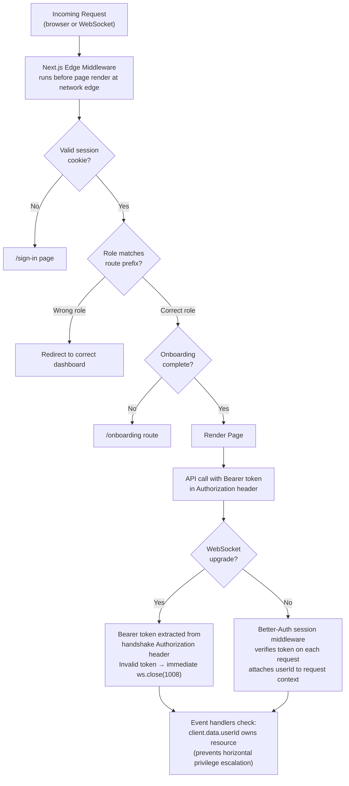

_Figure 5.1 — Multi-layer authorisation flow from Edge to WebSocket._

**Diagram Explanation — Figure 5.1: Multi-Layer Authorisation Flow**

This diagram documents the three distinct security checkpoints that every request must pass before reaching application logic. No single checkpoint is sufficient in isolation; the layered design ensures that a failure or bypass at one layer is caught by the next.

**Layer 1 — Next.js Edge Middleware:** This middleware runs at the CDN edge before the Next.js application server is involved. It checks the session cookie's validity (format and expiry), reads the `role` claim from the session (without a database round-trip, since the claim is embedded in the token), and verifies that the requested URL prefix matches the user's role. A patient requesting a therapist-only dashboard route is redirected immediately at the edge. This prevents even rendering the page's server components, which might inadvertently fetch data the user should not see.

**Layer 2 — Better-Auth Session Middleware (HTTP):** For every API request arriving at the NestJS server on port 3001, the Better-Auth middleware queries the PostgreSQL `session` table to validate the Bearer token. This step is a full database read, providing cryptographic certainty that the token has not been tampered with and has not expired. The middleware attaches the verified `userId` to the NestJS request context, making it available to all controllers and services downstream.

**Layer 3 — WebSocket Handshake Authentication:** For WebSocket upgrade requests (chat connections), the Bearer token is extracted from the `Authorization` header sent during the initial handshake. An invalid or missing token causes the server to immediately close the socket with code `1008 Policy Violation`. If the token is valid, the `userId` is stored on the socket's `client.data` object. All subsequent event handlers in the gateway read `client.data.userId` to scope data access, preventing horizontal privilege escalation where one patient could read another patient's chat history by guessing a session ID.

### 5.3 Content Security Layer

**Response Validator (Voice Pipeline):**
Six compiled regex patterns (Figure 3.12) intercept harmful AI output before it reaches speech
synthesis. The validator runs synchronously in the hot path — zero asynchronous overhead. Any match
substitutes a safe fallback response.

**Tool-Calling Constraints:**
The `escalate_to_clinician` StructuredTool docstring includes explicit positive and negative examples.
This in-context steering calibrates the LLM's escalation threshold, reducing both false positives
(crisis trigger on metaphorical language) and false negatives (missed genuine crisis expressions).

**Server Actions:**
All Groq API calls, authentication exchanges, and profile mutations use Next.js Server Actions —
server-only code that is never present in the client JavaScript bundle. API keys and session
secrets are unreachable from the browser.

**Path Restriction on Stream Service:**
`apps/stream/index.ts` checks `request.url` before WebSocket upgrade. Any path other than
`/crisis/stream` receives close code `1008 Policy Violation`. This prevents the real-time audio
endpoint from being probed or misused by arbitrary WebSocket clients.

**Therapist Verification Gate:**
`GET /recommendation` always filters `WHERE isVerified = true`. An unverified therapist will never
appear in patient-facing search regardless of their account status.

### 5.4 Data Protection Matrix

| Data Category       | Storage                       | Access Control                                             |
| ------------------- | ----------------------------- | ---------------------------------------------------------- |
| Passwords           | PostgreSQL `account.password` | bcrypt hash — never stored in plaintext                    |
| OAuth tokens        | PostgreSQL `account`          | Server-side only; never sent to client                     |
| Chat messages       | MongoDB `chat_messages`       | Scoped by `sessionId`; only session owner can query        |
| Emergency contacts  | PostgreSQL `patient_profile`  | Readable only by owning patient and admin                  |
| Crisis call history | Redis keys (30 min TTL)       | Ephemeral — not persisted after call ends                  |
| LLM response cache  | Redis (short TTL)             | Internal server-to-server only                             |
| API secrets         | `.env` files                  | `.gitignore`d; confirmed by `git ls-files` returning empty |

### 5.5 Infrastructure Security

- **HTTPS/WSS in Production:** Nginx (`infra/nginx.conf`) terminates TLS, proxying to `apps/api`
  (3001) and `apps/stream` (3002) via localhost. All external client connections use HTTPS/WSS.
- **Redis `maxmemory` + `allkeys-lru`:** Limits Redis to 256 MB and evicts least-recently-used
  keys, preventing a runaway crisis call from consuming unbounded memory.
- **Rate Limiting:** NestJS `@Throttle()` decorators protect authentication endpoints. Groq Cloud
  enforces API-level token rate limits independently.
- **Docker container isolation:** Each service runs in its own container with minimal exposed ports.
  The PostgreSQL and MongoDB containers expose no ports externally in production configuration.

### 5.6 OWASP Top 10 Alignment

| OWASP Risk                        | Mitigation in Sama                                                                                                                                          |
| --------------------------------- | ----------------------------------------------------------------------------------------------------------------------------------------------------------- |
| A01 Broken Access Control         | JWT role claims enforced at Edge Middleware; server-side session verification; WebSocket `userId` trust model; `therapistId` ownership checks on all writes |
| A02 Cryptographic Failures        | bcrypt for passwords; HTTPS/WSS transport; HTTP-only cookies; session tokens never logged                                                                   |
| A03 Injection                     | Drizzle parameterised queries (SQL injection impossible by construction); Zod DTO validation on all inputs                                                  |
| A04 Insecure Design               | Clean Architecture separation of concerns; ResponseValidator content guardrail; `isVerified` gate; admin-only verification endpoint                         |
| A05 Security Misconfiguration     | All secrets in `.env` (git-excluded); Docker container isolation; Redis maxmemory policy                                                                    |
| A06 Vulnerable Components         | pnpm lockfile ensures reproducible dependency resolution; Turborepo content-hash caching                                                                    |
| A07 Authentication Failures       | Better-Auth with session rotation; PKCE for OAuth; OTP TTL; bcrypt; session expiry enforcement                                                              |
| A08 Software & Data Integrity     | Turborepo content-hash build cache; pnpm lockfile; migration versioning via drizzle-kit                                                                     |
| A09 Security Logging & Monitoring | Better-Auth audit log plugin; Redis TTL-based ephemeral session cleanup; Twilio webhook status callbacks                                                    |
| A10 SSRF                          | Server Actions restrict all external API calls to server-side code; no user-controlled URLs accepted as inputs                                              |

---

## 6. Results and Evaluation

### 6.1 Feature Completeness Matrix

| Feature                                           | Module               | Status                 |
| ------------------------------------------------- | -------------------- | ---------------------- |
| Email/password authentication                     | AuthModule           | Implemented            |
| Google OAuth SSO                                  | AuthModule           | Implemented            |
| Phone OTP authentication (Twilio Verify)          | AuthModule           | Implemented            |
| Patient multi-step onboarding                     | ProfileModule        | Implemented            |
| Therapist onboarding + license upload             | ProfileModule        | Implemented            |
| Admin therapist verification gate                 | ProfileModule        | Implemented            |
| AI companion chat with streaming                  | ChatModule           | Implemented            |
| Human therapist chat                              | ChatModule           | Implemented            |
| `isAiActive` automatic AI/human switch            | ChatModule           | Implemented            |
| Session context persistence (summary, topics)     | ChatModule           | Implemented            |
| Crisis detection via tool-calling                 | ChatModule           | Implemented            |
| Twilio outbound crisis voice call                 | CrisisModule         | Implemented            |
| Emergency contact SMS fallback                    | CrisisModule         | Implemented            |
| LLM-expanded therapist recommendation             | RecommendationModule | Implemented            |
| MongoDB indexText search                          | RecommendationModule | Implemented            |
| Connection request/accept/reject/end lifecycle    | ConnectionModule     | Implemented            |
| `nextSession` scheduling                          | ConnectionModule     | Implemented            |
| Therapist review and rating                       | ProfileModule        | Implemented            |
| Presence system (online/busy/unavailable/offline) | ChatModule           | Implemented            |
| `assignedTherapistId` primary therapist           | ProfileModule        | Implemented            |
| Voice barge-in interruption                       | StreamHandler        | Implemented            |
| Response Validator (6-pattern + length guard)     | ResponseValidator    | Implemented            |
| Audio mulaw → PCM16 pipeline                      | AudioPipeline        | Implemented            |
| Deepgram nova-3 STT keep-alive                    | StreamHandler        | Implemented            |
| ElevenLabs native ulaw_8000 TTS                   | StreamHandler        | Implemented            |
| Redis FSM state management                        | RedisSession         | Implemented            |
| Redis Pub/Sub crisis signalling                   | CrisisService        | Implemented            |
| Docker Compose multi-service deployment           | infra                | Implemented            |
| Turborepo incremental build pipeline              | monorepo             | Implemented            |
| Shared `packages/ui` component library            | packages/ui          | Implemented            |
| Next.js Edge Middleware auth gate                 | apps/web             | Implemented            |
| Server Actions for sensitive operations           | apps/web             | Implemented            |
| Offline GPT-4o prompt optimizer                   | scripts/             | Implemented (dev-only) |

### 6.2 Performance Characteristics

| Metric                                          | Observed (Development) | Target    |
| ----------------------------------------------- | ---------------------- | --------- |
| LLM token-first-byte (Groq Cloud)               | 80–120 ms              | < 200 ms  |
| End-to-end voice latency (Twilio → patient ear) | 200–350 ms             | < 500 ms  |
| Chat message DB round-trip (PG + Mongo query)   | < 30 ms                | < 100 ms  |
| Recommendation search (LLM expand + Mongo + PG) | < 400 ms               | < 1000 ms |
| WebSocket auth handshake overhead               | < 15 ms                | < 50 ms   |
| Turborepo incremental build (no source change)  | < 2 s                  | —         |

Groq's LPU-based inference provides dramatically lower token generation latency compared to
GPU-based providers. This is the primary enabling factor for the voice pipeline where every
additional 100 ms of LLM latency manifests as perceptible dead air.

### 6.3 Architectural Validation

The dual-service microarchitecture demonstrates clean separation of concerns:

- Simulated concurrent voice sessions on `apps/stream` produce no measurable degradation in
  `apps/api` HTTP response times.
- Redeploying `apps/stream` with an updated Deepgram model requires zero downtime for chat users.
- The Clean Architecture was validated by successfully swapping the production Groq provider for a
  local Ollama instance during development testing — requiring only a constructor injection
  configuration change.

---

## 7. Conclusion and Future Work

### 7.1 Conclusions

Sama demonstrates that a production-quality AI mental wellness platform can be built with open-source
tooling without sacrificing clinical responsibility. Five key architectural insights were validated:

1. **Microservice isolation for voice is not premature optimisation.** The 40 ms audio frame
   constraint creates real concurrency requirements incompatible with REST API SLAs when running in
   the same process.
2. **LLM tool-calling is a superior crisis detector** compared to keyword matching, producing
   dramatically fewer false positives on figurative language.
3. **A hybrid database strategy** — PostgreSQL for relational integrity plus MongoDB for document
   message history — serves the platform's two distinct access patterns more naturally than either
   database alone.
4. **Redis as a finite state machine substrate** for real-time voice is the correct choice: its
   sub-millisecond reads handle the 40 ms audio hot path that PostgreSQL cannot serve.
5. **Layered content guardrails** — ResponseValidator, tool-calling constraints, server-side API
   calls — are necessary in a mental health context where a single harmful output could have
   severe real-world consequences.

### 7.2 Limitations

- **Voice latency** is partly dependent on Deepgram → Groq → ElevenLabs network round-trips.
  Self-hosting Deepgram and a local Ollama instance would reduce end-to-end latency to ~100 ms.
- **Audio upsampling** uses naive sample duplication for 8→16 kHz; a polyphase filter would improve
  STT accuracy on certain audio artefacts.
- **No fine-tuning:** the LLM is prompted but not fine-tuned on mental health dialogue.

### 7.3 Future Work

1. **Multilingual support:** Deepgram supports 30+ languages. Extending prompts to Hindi and Bengali
   would address India's linguistic diversity.
2. **Fine-tuned CBT model:** A LoRA fine-tune of Llama 3.3 70B on supervised CBT session transcripts
   (with appropriate ethical oversight) would improve therapeutic depth.
3. **Vector search migration:** As the therapist catalogue grows beyond 1,000 profiles, a Qdrant
   vector index should replace the current MongoDB regex approach.
4. **DPDPA compliance audit:** A formal Data Protection Impact Assessment for alignment with India's
   Digital Personal Data Protection Act 2023.
5. **Kubernetes deployment:** Migrate Docker Compose to Kubernetes with separate HPA policies for
   `apps/api` (RPS-based scaling) and `apps/stream` (active call count-based scaling).
6. **Wearable integration:** Physiological data (heart rate, GSR) from smartwatches could provide
   passive emotional state signals to the AI.

---

## 8. References

### A. Psychological and Therapeutic Foundations

[A1] Rogers, C. R. (1951). _Client-Centered Therapy: Its Current Practice, Implications and Theory_.
Houghton Mifflin.

[A2] Beck, A. T., Rush, A. J., Shaw, B. F., & Emery, G. (1979). _Cognitive Therapy of Depression_.
Guilford Press.

[A3] Vygotsky, L. S. (1978). _Mind in Society: The Development of Higher Psychological Processes_.
Harvard University Press.

[A4] Buber, M. (1923). _I and Thou_ (W. Kaufmann, Trans., 1970). Touchstone / Simon & Schuster.

[A5] Fitzpatrick, K. K., Darcy, A., & Vierhile, M. (2017). Delivering cognitive behavior therapy to
young adults with symptoms of depression and anxiety using a fully automated conversational agent
(Woebot): A randomized controlled trial. _JMIR Mental Health_, 4(2), e19.
https://mental.jmir.org/2017/2/e19

### B. AI and Machine Learning Research

[B1] Meta AI. (2024). _The Llama 3 Herd of Models_. arXiv preprint arXiv:2407.21783.
https://arxiv.org/abs/2407.21783

[B2] Vaswani, A., Shazeer, N., Parmar, N., Uszkoreit, J., Jones, L., Gomez, A. N., Kaiser, Ł., &
Polosukhin, I. (2017). Attention is all you need. In _Advances in Neural Information Processing
Systems_ (Vol. 30). https://arxiv.org/abs/1706.03762

[B3] Chase, H. (2022). _LangChain_ [Open-source library]. GitHub.
https://github.com/langchain-ai/langchainjs

[B4] Kessler, R. C., Berglund, P., Demler, O., Jin, R., Merikangas, K. R., & Walters, E. E. (2005).
Lifetime prevalence and age-of-onset distributions of DSM-IV disorders in the National Comorbidity
Survey Replication. _Archives of General Psychiatry_, 62(6), 593–602.

[B5] Topol, E. J. (2019). High-performance medicine: The convergence of human and artificial
intelligence. _Nature Medicine_, 25(1), 44–56.
https://www.nature.com/articles/s41591-018-0300-7

### C. Technology Documentation

[C1] NestJS. (2024). _NestJS: A progressive Node.js framework — Documentation_.
https://docs.nestjs.com

[C2] Drizzle Team. (2024). _Drizzle ORM Documentation_.
https://orm.drizzle.team/docs/overview

[C3] Better Auth. (2024). _Better Auth — Getting Started_.
https://www.better-auth.com/docs/installation

[C4] LangChain AI. (2024). _LangChain JS Documentation — Introduction_.
https://js.langchain.com/docs/introduction

[C5] Groq. (2024). _GroqCloud Developer Documentation_.
https://console.groq.com/docs/overview

[C6] Deepgram. (2024). _Deepgram Developer Documentation_.
https://developers.deepgram.com/home

[C7] ElevenLabs. (2024). _ElevenLabs API Documentation_.
https://elevenlabs.io/docs/overview/intro

[C8] Twilio. (2024). _Twilio Media Streams Documentation_.
https://www.twilio.com/docs/voice/media-streams

[C9] Twilio. (2024). _Twilio Verify — Phone Number Verification API_.
https://www.twilio.com/docs/verify/api

[C10] Redis. (2024). _Redis Pub/Sub Documentation_.
https://redis.io/docs/manual/pubsub/

[C11] Turborepo / Vercel. (2024). _Turborepo Documentation_.
https://turbo.build/repo/docs

[C12] MongoDB. (2024). _MongoDB Manual_.
https://www.mongodb.com/docs/

[C13] Next.js / Vercel. (2024). _Next.js Documentation — App Router_.
https://nextjs.org/docs

[C14] Socket.IO. (2024). _Socket.IO v4 Documentation_.
https://socket.io/docs/v4/

[C15] pnpm. (2024). _pnpm Workspaces Documentation_.
https://pnpm.io/workspaces

[C16] Docker. (2024). _Docker Compose Documentation_.
https://docs.docker.com/compose/

### D. Industry Reports and Regulatory Standards

[D1] World Health Organization. (2022). _World Mental Health Report: Transforming Mental Health
for All_. WHO Press.
https://www.who.int/publications/i/item/9789240049338

[D2] World Health Organization. (2021). _Comprehensive Mental Health Action Plan 2013–2030_.
WHO Press.
https://www.who.int/publications/i/item/9789240031029

[D3] Ministry of Electronics & Information Technology, Government of India. (2023). _Digital
Personal Data Protection Act, 2023_.
https://www.meity.gov.in/data-protection-framework

[D4] U.S. Department of Health & Human Services. (2024). _Health Insurance Portability and
Accountability Act (HIPAA) — Overview_.
https://www.hhs.gov/hipaa/index.html

[D5] OWASP Foundation. (2021). _OWASP Top Ten – 2021_.
https://owasp.org/www-project-top-ten/

[D6] American Psychological Association. (2023). _Guidelines for the Practice of Telepsychology_.
https://www.apa.org/practice/guidelines/telepsychology

_End of Report_

| Field         | Value                                                                                                                            |
| ------------- | -------------------------------------------------------------------------------------------------------------------------------- |
| Project Title | Sama — AI-Powered Mental Wellness Platform                                                                                       |
| Institution   | Institute of Engineering & Management, Kolkata                                                                                   |
| Programme     | Master of Computer Applications (MCA)                                                                                            |
| Session       | 2024–2026                                                                                                                        |
| Authors       | Sristi Shaw (12024006015052), Mousona Acharjee (12024006015029)                                                                  |
| Repository    | TherapyChatAgent                                                                                                                 |
| Tech Stack    | NestJS · Next.js 16 · PostgreSQL · MongoDB · Redis · Groq · Deepgram · ElevenLabs · Twilio · LangChain · Better-Auth · Turborepo |
